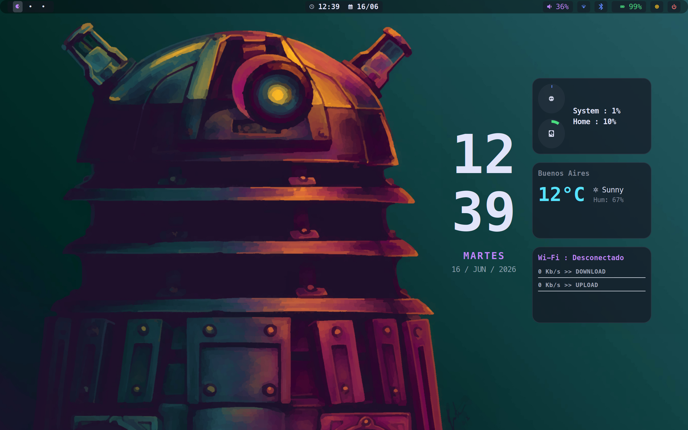
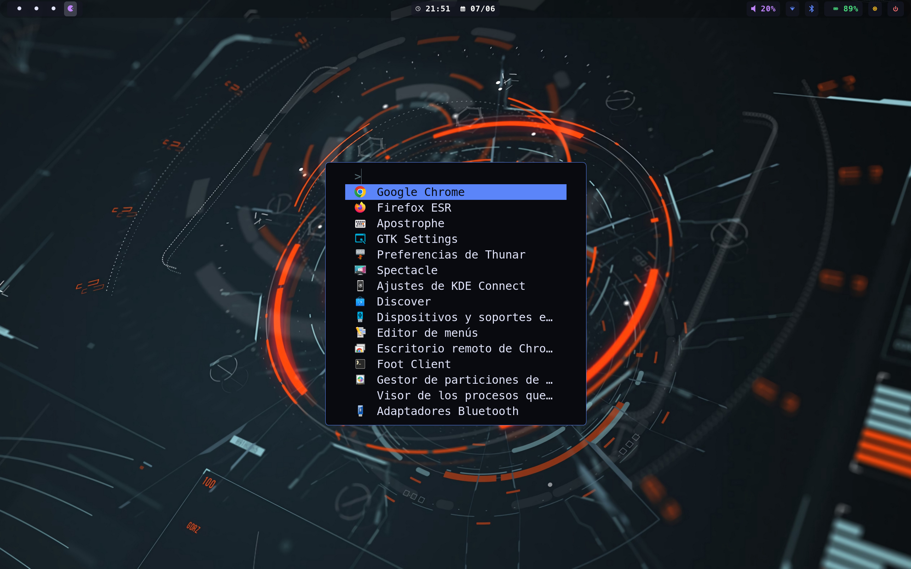

# 🚀 Hyprland + Eww para Debian 13 (Trixie)

Este repositorio contiene una configuración (dotfiles) completa y automatizada para transformar una instalación base de **Debian 13 (Trixie)** (se recomienda una instalacion minima) en un entorno de escritorio moderno, rápido y estéticamente pulido basado en **Hyprland** y **Eww**.


---

## 📸 Screenshots




---

## 🛠️ Requisitos Previos

1. **Sistema Operativo:** Debian 13 (Trixie) instalado (preferiblemente mínimo sin otro escritorio).
2. **Git:** Para clonar el repositorio.
3. **Fuente Nerd Font:** Se requiere una fuente parcheada (ej. Meslo, JetBrainsMono) para ver los iconos correctamente.
4. **Usuario:** Debes tener permisos de `sudo`.

---

## 🚀 Instalación en un Solo Paso

He diseñado un script inteligente que se encarga de todo: habilitar repositorios, instalar aplicaciones, y compilar la barra de estado.

### 1. Clonar el Repositorio
Abre tu terminal y descarga tus configuraciones:

```bash
git clone https://github.com/JoseloFlores/hypr.git
cd hypr
```

### 2. Ejecutar el Instalador
Simplemente ejecuta el script con permisos de superusuario:

```bash
sudo ./install.sh
```

**¿Qué hace este script por ti?**
- ✅ **Repositorios:** Habilita *Backports* (`trixie-backports`) con `contrib non-free non-free-firmware` sin tocar tus repos extra (brave/chrome/spotify/tailscale/vscode)
- ✅ **Drivers:** Detecta CPU Intel/AMD y GPU NVIDIA/AMD/Intel e instala microcode + mesa/nvidia + `firmware-linux-nonfree` y VAAPI
- ✅ **Comforts GNOME sin Mutter:** `nautilus` + `gvfs/udisks2/udiskie` (automontaje), `pavucontrol`+`pipewire`, `blueman`+`bluez`, `sway-notification-center`+`gnome-calendar`, `hyprpolkitagent`+`gnome-keyring` (PAM auto-unlock), `wl-clipboard`+`cliphist`, `gnome-settings-daemon` + `nwg-look` (no lxappearance)
- ✅ **Fuentes:** `fonts-jetbrains-mono` (apt) + `Meslo Nerd Font` + `Symbols Nerd` (descarga directa a `~/.local/share/fonts`)
- ✅ **Hyprland:** `hyprland/hyprlock/hypridle/hyprpolkitagent/greetd+tuigreet` desde backports + `xdg-desktop-portal-hyprland` + override `greetd` + `udev` brillo (`video` group) + `socat` para workspaces live
- ✅ **Compilación:** Compila **Eww** (`cargo --features wayland`) e instala en `/usr/local/bin/eww` y clona tema `JoseloFlores/eww` a `~/.config/eww` (rutas relativas, sin hardcode `/home/jose`)
- ✅ **Portabilidad:** Usa `Hyprland`/`start-hyprland` autodetectado, `xdg-user-dirs`, `socat`+`light` fallback brillo, `wireplumber` y `brightnessctl` sin lag
- ✅ **Servicios:** `greetd`+`bluetooth` enable, `gdm/sddm/lightdm` disable, `graphical.target`, `flatpak`+`flathub` para Zoom aislado

---

## ⌨️ Atajos de Teclado Principales (Guía Rápida)

Una vez reinicies y entres en Hyprland, estos son los comandos que necesitas conocer:

| Atajo | Acción |
| :--- | :--- |
| `Super + Enter` | Abrir Terminal (**Foot**) |
| `Super + C` | Abrir Navegador (**Firefox ESR**, instala Chrome manual si quieres) |
| `Super + D` | Lanzador de aplicaciones (**Fuzzel**) |
| `Super + X` | Explorador de Archivos (**Nautilus**) |
| `Super + Q` | Cerrar ventana activa |
| `Super + L` | Menú de Energía (Apagar/Reiniciar) |
| `Super + Shift + B` | Reiniciar barra Eww y sincronizar colores |
| `Super + 1-9` | Cambiar de escritorio |
| `Print` | Captura de pantalla (Seleccionar área) |

*(La tecla `Super` suele ser la tecla Windows , puedes modificarla a otra como `Alt`)*

---

## 🎨 Personalización y Temas

Este entorno utiliza un sistema de **Sincronización de Colores**:

1.  La fuente de verdad es el archivo `~/.config/eww/eww.scss`.
2.  Al presionar `Super + Shift + B`, el script `foot_sync.sh` lee el tema de Eww y aplica los mismos colores a tu terminal (**Foot**) y al lanzador (**Fuzzel**) automáticamente.

---

## 📁 Estructura de Archivos

*   `~/.config/hypr/`: Configuración principal del gestor de ventanas y scripts de sistema.
*   `~/.config/eww/`: Todo lo relacionado con la barra de estado y los widgets.
*   `~/.config/foot/`: Configuración de la terminal.
*   `~/.config/fuzzel/`: Configuración del lanzador de apps.

---

## ⚠️ Notas Importantes

- **Primer Inicio:** Si al entrar no ves la barra, presiona `Super + Shift + B` para forzar su inicio inicial.
- **Audio/Bluetooth:** Gestiona con `pavucontrol`, `blueman-applet` y teclas `XF86Audio*`/`brightnessctl`; scroll sobre iconos de volumen/brillo en `eww` ya funciona a la primera (fix `socat` + `udev` brillo).
- **Brillo:** Si tu equipo es desktop/VM sin backlight, el módulo muestra “no disponible” sin error; en laptops el scroll usa `brightnessctl -c backlight` + `light` fallback y `udev` `video` group.
- **Workspaces:** Requiere `socat` (ya instalado); si cambias de escritorio la barra refresca instantáneo vía `socket2`. Sin `socat` la barra no refresca.
- **Temas:** Usa `nwg-look` (Wayland native) en vez de `lxappearance` para no romper estilos `eww`/`swaync`. `lxappearance` sigue instalado por compat pero se recomienda `nwg-look`. Luego `Super+Shift+B`.
- **Zoom:** No instales el `.deb` oficial — rompe librerías `wayland`/`gtk-layer-shell` y los estilos de `eww`. Usa: `flatpak install flathub us.zoom.Zoom` (o `sudo ./install.sh --install-zoom`). Aislado vía portal `hyprland`.
- **Notificaciones/Calendario:** `swaync` (config `~/.config/swaync/config.json` con widget `calendar`) + `gnome-calendar` flotante. Click reloj eww → `swaync-client -t`.
- **VPN:** Icono eww (`eww_network.sh`) muestra VPN manual activa (ignora Tailscale).
- **Mutter:** No se instala `gnome-shell`/`mutter` a propósito para no romper `blur`/`rounding`/`opacity` de Hyprland (`hyprland.conf:130`).

---
*Desarrollado con ❤️ para la comunidad de Debian.*
