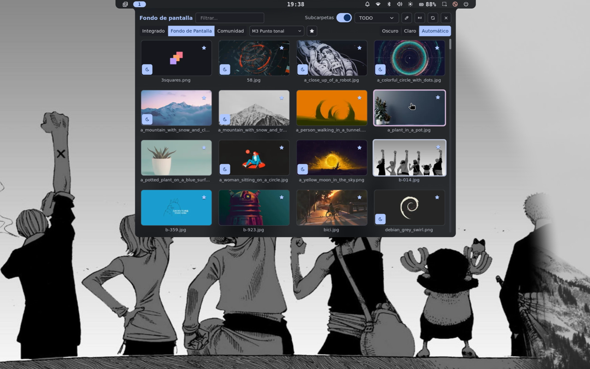

# Hyprland + Noctalia en Debian 13 — listo para usar

> Tu escritorio Wayland, bonito y sin pelearte con la config.
> **Hyprland + Noctalia + Thunar** en una instalación limpia de **Debian 13 `trixie`**, con todo lo esencial: barra, launcher, notificaciones, fondo automático y colores que combinan solos.


Instalador **modular y seguro**: 12 pasitos re-ejecutables en `install-scripts/`, con presets, modo simulación (`dry-run`) y chequeo final.

## 🎬 Demo

<video src="https://github.com/JoseloFlores/hypr/releases/download/demo/preview.mp4" poster="./preview.png" controls muted loop playsinline width="100%">
  Tu navegador no soporta video. <a href="https://github.com/JoseloFlores/hypr/releases/download/demo/preview.mp4">Ver/descargar demo</a>
</video>

[](https://github.com/JoseloFlores/hypr/releases/download/demo/preview.mp4)

---

## ✨ ¿Qué te llevas?

- **Hyprland 0.55** (desde `trixie-backports`) con `hyprlock`, `hypridle`, `hyprpolkitagent` y `hyprland-guiutils`
- **Noctalia v5 como corazón del escritorio**: barra, launcher, notificaciones y centro de control. Se inicia sola con `exec-once = noctalia`
- **Todo combina solo**: Noctalia saca la paleta de tu fondo (`theme.source = wallpaper`) y pinta GTK, bordes de Hyprland, Foot, wlogout, hyprlock y Neovim. Sin pywal, sin swaybg
- **Launcher único**: `SUPER + Espacio` (Noctalia). Sin launchers duplicados
- **Archivos y confort**: Thunar + automontaje (`udiskie`), keyring, polkit, Bluetooth (BlueZ), portapapeles persistente (`cliphist`)
- **Capturas y vídeo fáciles**: `grim + slurp | swappy` y `wf-recorder` con toggle, todo a `~/Pictures/Capturas`
- **Tu PC, detectado solo**: microcode Intel/AMD, aceleración VA-API según tu GPU, firmware y brillo con `brightnessctl`
- **Login limpio**: `greetd + tuigreet` en `tty1`

---

## 📁 ¿Qué hay en este repo?

```
hypr/
├── install.sh               # instalador: --preset / --only / --skip / --dry-run / --check
├── preset.example.sh        # todo ON (uso normal)
├── preset.minimal.sh        # solo dots, para probar sin tocar el sistema
├── dry-run-build.sh         # simula los 12 módulos (PASS/FAIL por módulo)
├── uninstall-lite.sh        # revierte dots + timer (--full toca greetd/NM/udev)
├── install-scripts/         # un script por fase, re-ejecutables
│   ├── Global_functions.sh  # logs, apt con reintentos, dry-run
│   ├── 10-repos.sh / 20-drivers.sh / 30-base.sh / 40-hypr.sh
│   ├── 50-fonts.sh / 60-greetd.sh / 70-dots.sh / 71-noctalia.sh
│   └── 80-pam-portals.sh / 90-services.sh / 95-grub.sh / 99-final-check.sh
├── hyprland.conf            # tu escritorio: atajos, reglas, autostart
├── noctalia/                # theming y shell
│   ├── bar-monitors.toml    # barra solo en la laptop (ajusta tu conector)
│   ├── templates.toml       # paleta + templates + rotación de fondo
│   ├── templates/           # foot.ini, hyprlock.conf, wlogout.css, matugen-template.lua
│   ├── hooks/               # foot-apply.sh, sync-lock-wallpaper.sh
│   ├── plugins-apply.sh     # re-aplica plugin grabador + parche (idempotente)
│   └── plugins/region-recorder-wf-fix.patch
├── foot.ini                 # terminal (los colores los pone Noctalia)
├── nvim/                    # Neovim con base16 (lazy.nvim baja los plugins)
├── wlogout/                 # menú de apagado: layout + icons/ (style.css lo genera Noctalia)
├── confirm_power.sh / screen_recorder.sh / auto_timezone.sh
├── hypridle.conf
├── systemd/user/            # auto-timezone.service + .timer (zona horaria al viajar)
├── preview.mp4 + preview.png  # demo del escritorio (video + miniatura)
└── NOCTALIA_COMANDOS.md     # chuleta de Noctalia ([ver](./NOCTALIA_COMANDOS.md))
```

---

## ⚙️ Antes de empezar

- Debian 13 `trixie` mínima, sin entorno gráfico previo (sin `sddm`/`gdm`)
- Internet a `deb.debian.org` y `pkg.noctalia.dev`, `sudo` a mano
- El instalador añade `contrib non-free non-free-firmware` y `trixie-backports` solo

---

## 🚀 Instalación en 2 pasos

```bash
git clone https://github.com/JoseloFlores/hypr.git
cd hypr
sudo ./install.sh   # logs en ./install.log + Install-Logs/
sudo reboot
```

¿Quieres ir por partes o probar sin miedo?

```bash
sudo ./install.sh --preset preset.example.sh      # lo normal: todo
sudo ./install.sh --only 70-dots,99-final-check   # solo reponer mis configs + verificar
./install.sh --dry-run --only 70-dots             # simular sin root ni cambios
./install.sh --check                              # ver los módulos sin ejecutar nada
./dry-run-build.sh                                # chequeo PASS/FAIL de los 12 módulos
sudo ./install-scripts/70-dots.sh                 # un módulo suelto, cualquiera vale
```

| Módulo | ¿Qué hace por ti? |
|---|---|
| `10-repos` | Deja APT fino + backports |
| `20-drivers` | Microcode, Mesa/VA-API según tu GPU, firmware |
| `30-base` | Apps del día a día: Thunar, `imv` + `mpv`, Firefox, Foot, capturas, Bluetooth, sonido… |
| `40-hypr` | Hyprland + lock + idle + polkit + greetd/tuigreet |
| `50-fonts` | Meslo Nerd Font + símbolos, en tu `~/.local/share/fonts` |
| `60-greetd` | Login bonito en `tty1` |
| `70-dots` | Copia mis configs a tu `~/.config` (sin pisar tu Noctalia/nvim si ya existen) |
| `71-noctalia` | Instala Noctalia (`noctalia-trixie`) + plugin grabador `region-recorder` con parche wf-recorder + valida tu config |
| `80-pam-portals` | Keyring desbloqueado al entrar + diálogos de archivo GTK |
| `90-services` | Red con NetworkManager, Bluetooth y greetd activados |
| `95-grub` | GRUB gráfico de Debian |
| `99-final-check` | Te dice si quedó `COMPLETADA` o falta algo |

Detalles del lote base (`30-base`, todo desactivable por preset):

- `thunar thunar-archive-plugin thunar-volman xarchiver tumbler ffmpegthumbnailer` (`INSTALL_THUNAR=OFF` lo salta) + `LANG=es_ES.UTF-8 xdg-user-dirs-update --force` para tener `~/Imágenes`, `~/Documentos`… en español
- `imv mpv` (`INSTALL_MEDIA=OFF` lo salta), `firefox-esr` (`INSTALL_FIREFOX=OFF` lo salta), `thunderbird` solo si `INSTALL_THUNDERBIRD=ON`
- `foot grim slurp swappy wf-recorder`, `wl-clipboard cliphist brightnessctl playerctl`, `nwg-look`, `mako-notifier` (solo para que Bluetooth no arrastre `cinnamon`; nunca se muestra, las notificaciones las da Noctalia)

> Al entrar, verifica: `hyprland --verify-config` → `config ok` y `noctalia config validate` → `✓ Config is valid`.

### Desinstalar sin drama

```bash
sudo ./uninstall-lite.sh          # quita mis dots (con backup fechado) + timer
sudo ./uninstall-lite.sh --full   # además apaga greetd y limpia overrides míos
```

No borra programas (si quieres: `sudo apt autoremove hyprland noctalia`).

---

## 🖥️ Tu día a día

| Atajo | Acción |
|---|---|
| `SUPER + Return` / `SUPER + F` | Terminal (Foot) |
| `SUPER + Espacio` | Launcher de Noctalia ⭐ |
| `SUPER + X` | Archivos (Thunar) |
| `SUPER + C` | Navegador (Firefox) |
| `SUPER + O` | Centro de control |
| `SUPER + coma` | Ajustes de Noctalia |
| `ALT + Tab` | Cambiar de ventana |
| `SUPER + 1..0` / `SHIFT + 1..0` | Ir a escritorio / llevar ventana |
| `SUPER + S` | Guardar ventana en scratchpad |
| `SUPER + L` | Apagar / salir (wlogout) |
| `SUPER + SHIFT + W` | Fondo aleatorio |
| `SUPER + SHIFT + B` | Reiniciar Noctalia si algo se ve raro |
| `Print` / `ALT+Print` / `SUPER+Print` | Captura área / ventana / monitor |
| `SHIFT+Print` / `CTRL+Print` | Grabar área / pantalla (pulsa otra vez para parar) |
| Teclas de brillo/volumen | Funcionan directo |

### Fondos y colores (todo desde Noctalia)

```bash
noctalia msg wallpaper-set /ruta/a/tu/foto.jpg   # pone fondo + recolorea todo
noctalia msg wallpaper-random                     # sorpréndeme (también SUPER+SHIFT+W)
noctalia msg templates-apply                      # repintar apps tras tocar templates
```

Tus fondos viven en `~/Imágenes/wallpapers/wallpaper` (se crean solos; puedes precargarlos con `WALLPAPER_URL` en tu preset). Rotan cada 30 min. `nwg-look` queda solo como visor: el tema real lo pone Noctalia.

### Zona horaria que viaja contigo

Cada 30 min revisa tu zona por IP y la aplica. Compruébalo con:

```bash
systemctl --user list-timers auto-timezone.timer
systemctl --user enable --now auto-timezone.timer   # si no estaba activo
```

---

## 🔧 Hazlo tuyo

- **Monitores**: este repo arranca con `monitor=,preferred,auto,1` (vale para cualquiera). Para dual-monitor mira `hyprctl monitors` y descomenta el ejemplo en `hyprland.conf`. La barra de Noctalia sale solo en la laptop (`noctalia/bar-monitors.toml`, ajusta el `match` a tu conector como `eDP-1`).
- **Rutas portables**: todo usa `$HOME`/`~`. Nada de `/home/tu-usuario` a fuego.
- **Presets**: copia `preset.example.sh`, pon `OFF` a lo que no quieras (`INSTALL_THUNAR`, `INSTALL_MEDIA`, `INSTALL_FIREFOX`…) y lanza con `--preset`.
- **GPU NVIDIA**: se detecta sola (`NVIDIA_MODE=auto`; `OFF` la ignora).

---

## 🩹 Si algo se tuerce

**El brillo dice `Permission denied`**
> Te falta el grupo `video` o recargar udev. El instalador ya lo hace, pero si vienes de otra config:
> ```bash
> sudo usermod -aG video,input $USER
> echo 'SUBSYSTEM=="backlight", ACTION=="add", RUN+="/bin/chgrp video /sys/class/backlight/%k/brightness", RUN+="/bin/chmod g+w /sys/class/backlight/%k/brightness"' | sudo tee /etc/udev/rules.d/90-backlight.rules
> sudo udevadm control --reload-rules && sudo udevadm trigger --subsystem-match=backlight --action=add
> ```
> Entra de nuevo para que los grupos apliquen.

**La hora sale en UTC**
> ```bash
> sudo timedatectl set-timezone America/Montevideo   # tu zona
> ```
> El timer lo mantiene solo a partir de ahí.

**Noctalia no arranca o no hay barra**
> ```bash
> noctalia config validate
> tail -n 50 ~/.cache/noctalia/noctalia.log
> hyprctl layers | grep noctalia
> noctalia msg config-reload
> ```
> Si tu `~/.config/noctalia/` ya existía, no se pisa: compárala con la del repo. Y si tocaste la GUI, manda `~/.local/state/noctalia/settings.toml`.

**Un módulo falló / quiero repetir solo una parte**
> ```bash
> ./dry-run-build.sh --only 70-dots,99-final-check
> sudo ./install.sh --only 70-dots,99-final-check
> cat Install-Logs/70-dots-*.log
> ```

---

## 📜 Licencia y gracias

Dotfiles bajo MIT (ver `LICENSE`). Hyprland es BSD-3.

Gracias a [Hyprland](https://hypr.land), [Noctalia](https://noctalia.dev), [Nerd Fonts](https://www.nerdfonts.com) y la idea modular inspirada en [Debian-Hyprland (KooL Dots)](https://github.com/LinuxBeginnings/Debian-Hyprland) (aquí todo vía `apt`, sin compilar).

> **Truco final:** `SUPER + SHIFT + B` reinicia Noctalia. Y para logs: `cat install.log`, `ls Install-Logs/`, `hyprland --verify-config`, `noctalia config validate`.
